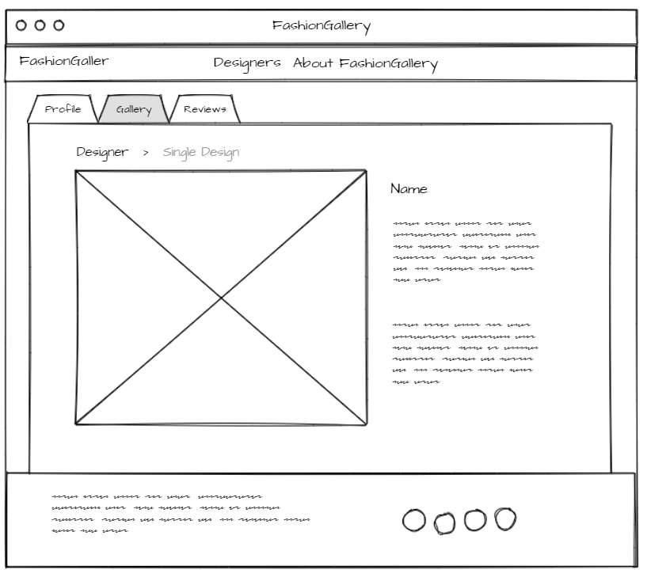

# FashionGallery

## Project Description

Fashion Gallery is a fashion broker website that connect the fashion designers from all around the world with their fans. Fans can search about their favourite designers and see their new work. They can view their contact info and write comments. Each designer will have a page for showing their work, the comments they receive and rate.

Functionality:
In the project, we have two kinds of users, designers and fans. The designer will be able to:
- Sign up a new account
- Login/logout with sessions
- View/edit own profile
- Add/edit/delete own posts
- View single post
- View all posts

On the other hand, the fan will be able to:

- Sign up a new account
- Login/logout with sessions
- View all designers
- View single designer page (profile, work, review)
- Search for a designer
- Rate a designer
- Write a comment for a designer

## Project Wireframe

  
  <i>Fig. 1: The Login/Signup Page</i>
    
  
  <i>Fig. 2: The home Page</i>
    
  
  <i>Fig. 3: The Designer Profile Page</i>
    
  
  <i>Fig. 4: The Designer Gallery (Fan View) Page</i>
    
  
  <i>Fig. 5: The Single Post Page</i>
    
  
  <i>Fig. 6: The Designer Gallery (Desginer View) Page</i>
    
  
  <i>Fig. 7: The Reviews Page</i>
    
  
  <i>Fig. 8: The Add Review Page</i>

## Technologies Used
- [Wireframe tool](https://mockflow.com/app/#Wireframe)
- PL: HTML, CSS, JS, Express Js, 
- DB: Mongoo
- Deployment: Heroku
- VS Code editor.
- Chrome Developer tool.
